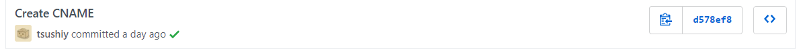

ポートフォリオ（みたいな）サイトが欲しいなと思ってHugo + GitHub Pagesで本サイトを立ち上げたので流れをまとめます。

## 静的サイトジェネレータについて

静的サイトジェネレータは、テンプレートエンジンを用いてhtmlを生成するツール。  
サクッとポートフォリオサイトを立ち上げたり、サクッとMarkdownで記事を書けたりする。

こちらの方の記事がわかりやすくまとめられています。  
[静的サイトジェネレータの世界 (1) : 概要 - YoshinoriN's Memento](https://yoshinorin.net/2018/10/18/world-of-ssg/)

### 静的サイトジェネレータの嬉しい点

* DBを使用しないためセキュリティの面で優秀
* サイトへのアクセスが高速
* Markdownで記述できる
* 公開されているテーマを使用できる

## Hugoでサイトを生成する

Golangで書かれた[Hugo](https://gohugo.io/)を使う。ビルドが爆速。

[Install Hugo | Hugo](https://gohugo.io/getting-started/installing)に従ってHugoをインストール。  
ただしUbuntuの場合は、`sudo apt install hugo`だと最新のHugoが入らないので、https://github.com/gohugoio/hugo/releases から最新のものをインストールする。

```bash
$ wget https://github.com/gohugoio/hugo/releases/download/v0.54.0/hugo_0.54.0_Linux-64bit.deb
$ sudo apt install ./hugo_0.54.0_Linux-64bit.deb
```

[Quick Start | Hugo](https://gohugo.io/getting-started/quick-start/)に従ってサイトを生成。

[Hugo Themes](https://themes.gohugo.io/)からテーマを選ぶ。（Quick Startの例はAnanke）  
テーマはQuick Startの通りにサブモジュールで管理すると、テーマのアップデートも`git submodule update`とかで簡単にできるので楽で良いと思います。

```bash
$ git submodule add https://github.com/budparr/gohugo-theme-ananke.git themes/ananke
```

`hugo new posts/my-first-post.md`で新しい記事を作成。  
`hugo server`でHugoサーバーを http://localhost:1313/ に立ち上げる。  
`hugo`でquickstart/public以下に公開用のファイル群が生成される。

あとは適宜テーマやconfig.tomlをカスタマイズしていい感じにする。

## GitHub Pagesでホスティングする

ホスティングにはGitHub Pagesが無料かつ簡単なのでこれを使う。  
NetlifyもGitHubのリポジトリと連携できるので簡単。

[Host on GitHub | Hugo](https://gohugo.io/hosting-and-deployment/hosting-on-github/)に、GitHub Pagesでホスティングする際のチュートリアルがある。  
今回はサブドメインは使用しません。

GitHub Pagesでソース管理とホスティングをするので、GitHubにリポジトリを2つ作成し、config.tomlに`baseURL = https://[GitHubのユーザ名].github.io/`と書く。

* `blog`リポジトリ: ソースファイル  
* `<username>.github.io`リポジトリ: 公開ファイル

publicフォルダもサブモジュールとして管理するため、1度publicフォルダを削除してサブモジュールとして登録する。

```bash
$ git remote add origin git@github.com:<username>/blog.git

$ rm -rf public
$ git submodule add git@github.com:<username>/<username>.github.io.git public
```

publicとquickstartをそれぞれ`<username>.github.io`と`blog`にpush。  
サブモジュールであるpublicから先にpushしましょう。

以下は[Host on GitHub](https://gohugo.io/hosting-and-deployment/hosting-on-github/)にあるdeploy.shを書き換えたもの。  
quickstart直下に置いて`./deploy.sh "Your optional commit message"`で、`<username>.github.io`と`blog`に続けてpushできる。

```bash
#!/bin/bash

echo -e "\033[0;33mDeploying updates to GitHub...\033[0m"

# Build the project.
hugo

# Go to public folder
cd public
# Add changes to git.
git add .

# Commit changes.
msg="rebuilding site `date`"
if [ $# -eq 1 ]
  then msg="$1"
fi
git commit -m "$msg"

# Push source and build repos.
git push origin master

# Come back
cd ..
# Add changes to git.
git add .

# Commit changes.
msg="rebuilding site `date`"
if [ $# -eq 1 ]
  then msg="$1"
fi
git commit -m "$msg"

# Push source and build repos.
git push origin master
```

これでhttps://\<username>.github.io/にサイトが立ち上げられる。

## 独自ドメインを適用する

せっかくなので独自ドメインにしました。HTTPS化もします。  
[Adding or removing a custom domain for your GitHub Pages site - GitHub Help](https://help.github.com/en/articles/adding-or-removing-a-custom-domain-for-your-github-pages-site)にある通りに設定する。

今回サブドメインは使わないので、取得した独自ドメインに4つのAレコードを設定する。  
参考までに、バリュードメインではDNS設定に以下を書く。

```
a @ 185.199.108.153
a @ 185.199.109.153
a @ 185.199.110.153
a @ 185.199.111.153
```

`<username>.github.io`リポジトリのSettingsを開き、GitHub Pagesの欄のCustom domainに独自ドメインを入力し、Enforce HTTPSをチェック。  
反映されるまで多少時間がかかる。

で、これをやると勝手に`<username>.github.io`リポジトリにCNAMEファイルが追加される。



それに気付かずに`./deploy.sh`してもなんか反映されないなと思ったらpushがrejectされてました。  
`cd public && git pull`してローカルリポジトリにマージしときましょう。

## 詰まったところ

### HugoでSCSSを使う

SCSSを使う場合には[SASS / SCSS | Hugo](https://gohugo.io/hugo-pipes/scss-sass/)のようにする。  
参考：[Sass (SASS/SCSS) スタイルシートを使用する | まくまくHugo/Goノート](https://maku77.github.io/hugo/advanced/sass.html)

```go
{{ $style := resources.Get "scss/style.scss" | toCSS | minify | fingerprint }}
<link rel="stylesheet" href="{{ $style.Permalink }}">
```

使用したテーマがlink要素でintegrity属性を指定していたのでこのまま使うことにした。

```go
<link rel="stylesheet" href="{{ $style.Permalink }}" {{ printf "integrity=%q" $style.Data.Integrity | safeHTMLAttr }}>
```

これはCDNリソースの改竄を検知するための属性なので、自分のリポジトリのCSSを参照する以上不要なのではと思うのですが、使って悪いこともないのでそのまま使ってます。  

ここで問題が。独自ドメインに変更したところ、CSSが反映されなくなった。  
エラーメッセージでintegrity checkのためにCORSを許可しろって言われる。

>Subresource Integrity: The resource 'https://tsushiy.com/css/style.min.css' has an integrity attribute, but the resource requires the request to be CORS enabled to check the integrity, and it is not. The resource has been blocked because the integrity cannot be enforced.

結局、config.tomlのbaseURLを変更したつもりが反映されていなかったためにcssのソースがtsushiy.github.ioになっていたのが問題で、baseURLを新しいURLに変更して時間を置いたらソースがtsushiy.comに切り替わってくれたので、CORSを許可する必要はなかった。

以下の内容はこれに気付く前に対策した方法なので読み捨てて大丈夫です。

---
別ドメインのリソースにアクセスするために`crossorigin="anonymous"`を追加する。

```go
<link rel="stylesheet" href="{{ $style.Permalink }}" {{ printf "integrity=%q" $style.Data.Integrity | safeHTMLAttr }} crossorigin="anonymous">
```