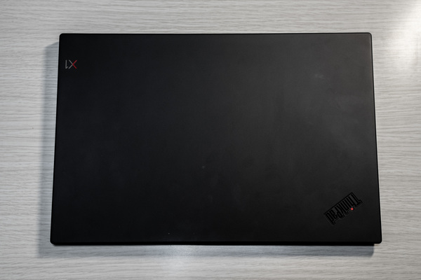
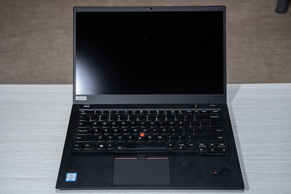
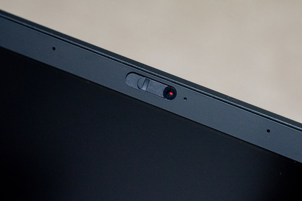
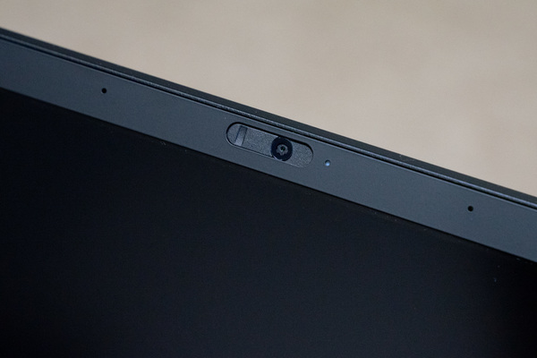
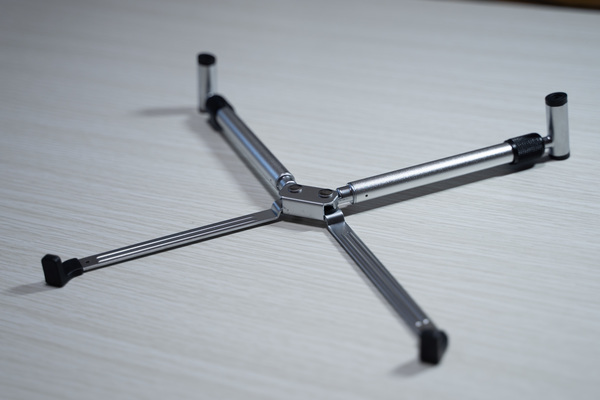
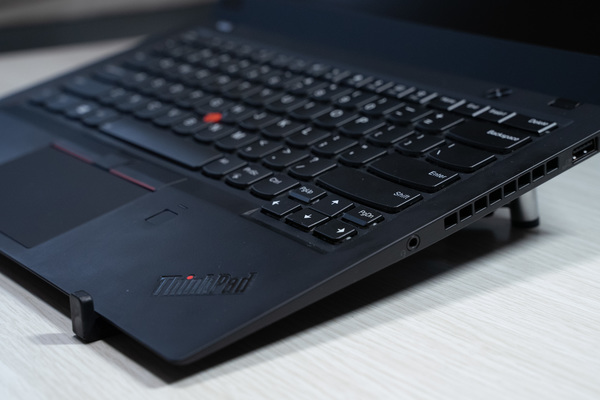

ThinkPad X1 Carbon 2018 を買いました。

## ラップトップPCを買った理由

2017年に買ったデスクトップがこんな感じで、これを普段使いしてました。

* CPU：Core i7-6700K
* GPU：GTX1070
* メモリ：16GB

ラップトップの方は2015年に買ったものでこんな感じ。

* CPU：Core i5-4210
* メモリ：8GB
* ディスプレイ：13.3型

デスクトップとラップトップの性能差が激しいとラップトップを全く使いたくなくなるので、買いました。

## ThinkPad X1 Carbonにした理由

候補にはXPS 13やLG gramもありましたが、ThinkPadを選んだのはキーボードがいい感じだったのと、安かったので。  
キーボードはストロークが深め。寒い日には厳しい。

中古で以下のスペックのものを14万円で買いました。

* CPU：Core i7-8550U
* メモリ：16GB
* SSD：512GB（PCIe）
* ディスプレイ：WQHD（ノングレア）
* WWANあり

公式直販サイトだと学割効かせても、最小構成（i5-8250U, メモリ8GB, SSD128GB（SATA）, FHD液晶, WWANなし）で14万円します。

元々SSDはSATAの1TBを別で買って交換するつもりだったし液晶もFHDで良いつもりだったけど、これを見つけたらもう買うしか無かった。

USキーボードになりました。

今までJISキーボードマン、「+」とか打つとき遠くて困惑する。

## 2018モデル

2019モデルの違い

* CPUは変わらず
* 液晶の選択肢増
* microSDスロット無くなった
* バッテリ容量減った
* スピーカー良くなった

個人的には2019を選ぶメリットがありませんでした。

2017モデルはCPUが第7世代でした。  
第6世代と第7世代の差以上に第7世代と第8世代のスペック差が大きかったので、選ぶ最低条件に第8世代ってのがありました。  

ベンチマーク  
<https://cpu.userbenchmark.com/Compare/Intel-Core-i7-8550U-vs-Intel-Core-i7-7600U/m320742vsm220838>  
<https://cpu.userbenchmark.com/Compare/Intel-Core-i7-6600U-vs-Intel-Core-i7-7600U/m36828vsm220838>

## ここが良いよ X1 Carbon

* 14.0型の大きさが程良い
* 軽い
* 小さい
* 静か
* キーボードが打ちやすい（これは結構人による）
* 指紋認証 微妙
* WQHD 目が疲れにくい
* カメラにカバーがある

これ好き。

## ここがダメだよ X1 Carbon

* SDカードスロットがあったら嬉しい
  * 一眼を使うので
* トラックポイントは使ってない
* 本体が黒いから埃がすごく目立つ

## 雑記

排熱が気になったからスタンドも買った。  
<https://www.amazon.co.jp/gp/product/B07DG3YTW3/>

かっこいい

半据え置きとして使うときに排熱気になりますよね。