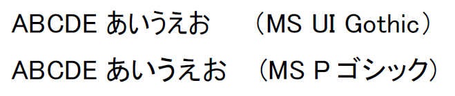
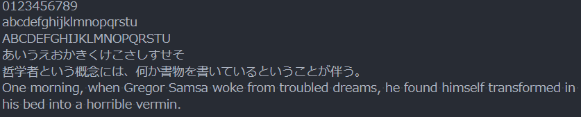
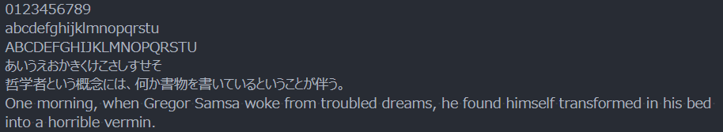
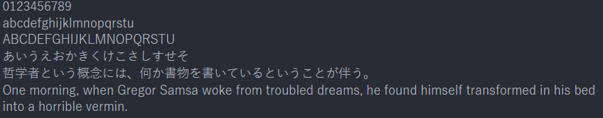
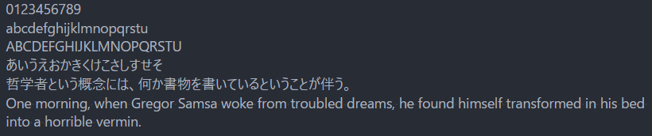
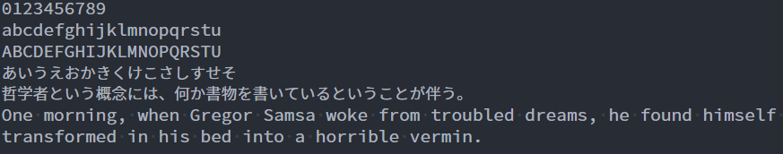

Windowsで使うフォントについての話です。

## TL;DR

Windowsでパワポやエディタに使うおすすめフォント：  

* 互換性が重要なら和文を**メイリオ**、欧文を**Yu Gothic UI**  
* 互換性無視でフリーフォントを使うなら**源ノ角ゴシック**  
* コーディング用のエディタには**源ノ角ゴシック Code JP**

## Macならヒラギノフォント

Macのヒラギノ角ゴシックって綺麗ですよね。Macからぶっこ抜いてWindowsに移すのはライセンス違反だからダメです。

>   
> 出典：[角ゴシック | ヒラギノフォント](http://www.screen-hiragino.jp/lineup/hirg/)

Windowsでパワポを作って、PPTのまま共有する前提なら標準フォントを使う。  
PDFにするならフォント埋め込めばいいからなんでもいい。

Windowsに慣れきった身だとMSゴシックに不満は感じませんが、Macから戻ると見辛さを感じます。

## Windowsの主な標準フォント

* MSゴシック/明朝、MS UI Gothic
  * 一番古い。あまり綺麗じゃない
* メイリオ、Meiryo UI
  * 結構綺麗。Google Chromeの標準フォントもこれ
* 游ゴシック/明朝、Yu Gothic UI
  * 綺麗だけど場合によっては細すぎる
* Arial
* Calibli
  * 嫌いじゃない
* Consolas
  * コーディング用によく使われるらしい
* Times New Roman

明朝は見辛いから、デザインの話にならない限りは基本ゴシック。

メイリオは綺麗。欧文は少し幅広。  
游ゴシックも好きだけどパワポで使うには細い。  
Yu Gothic UIの欧文はバランスが良い。

結論：パワポで互換性を重視するときのフォントは、和文欧文ともにメイリオにする。もしくは和文をメイリオ、欧文をYu Gothic UIにする。

### Pフォント

Pはプロポーショナルフォントのことで、文字ごとに幅が異なる。Pじゃない方は等幅フォントで、文字ごとの幅が等しい。

>   
> 出典：[プロポーショナルフォント - Wikipedia](https://ja.wikipedia.org/wiki/プロポーショナルフォント)  
>　（上段）プロポーショナル  
>　（下段）モノスペース/等幅

パワポとか普通の記事とかならPフォントを選ぶ。コーディング用途なら等幅フォントじゃないと見辛い。

### UIフォント

UIは「ユーザインタフェース」のことで、要はインタフェース向けに文字の幅を詰めたもの。

## フリーフォントを使う

PDFにフォントを埋め込むなら、Adobeの開発した[源ノ角ゴシック (Source Han Sans JP)](https://github.com/adobe-fonts/source-han-sans)というフォントがオススメ。
GoogleでもNoto Sans Japaneseという名前でほとんど同じものを出してるので好きな方を使いましょう。

自分はAdobeサブスクリプションユーザなので、Adobe Typekitで管理できるSource Han Sans JPの方を使ってます。

## コーディングには源ノ角ゴシック Code JP

源ノ角ゴシックはプロポーショナルフォントなので、コーディングには適しません。  
そこで、これまたAdobeが開発した[源ノ角ゴシック Code JP (Source Han Code JP)](https://github.com/adobe-fonts/source-han-code-jp)。  
見やすい。オススメ。

* 源ノ角ゴシック（和文）+Source Code Pro（欧文）の等幅フォント
* 半角：全角 = 2:3
* 1, I, l, O, 0が簡単に判別できる

## サンプル

メイリオ  

Meiryo UI  

游ゴシック  

Yu Gothic UI  

源ノ角ゴシック Code JP  

