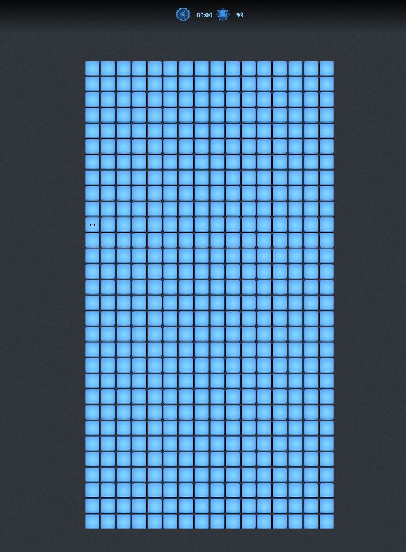

Microsoft Minesweeperを自動で解くプログラム。  
研究室のマインスイーパーが強い先輩を（チートで）倒すモチベで作りました。

# Demo

# Microsoft Minesweeper

Microsoft Minesweeperは、マス目の大きさや縦横の向きがウィンドウサイズで変化します。  
なので画面から矩形を識別してマス目を把握して、真ん中の数ピクセルの色を見て数字とか判別してます。

# マインスイーパーを解くアルゴリズム

[マインスイーパのモデル化と解法 - Qiita](https://qiita.com/gyu-don/items/9d1d77830d96d43fc887)を大いに参考にしています。
