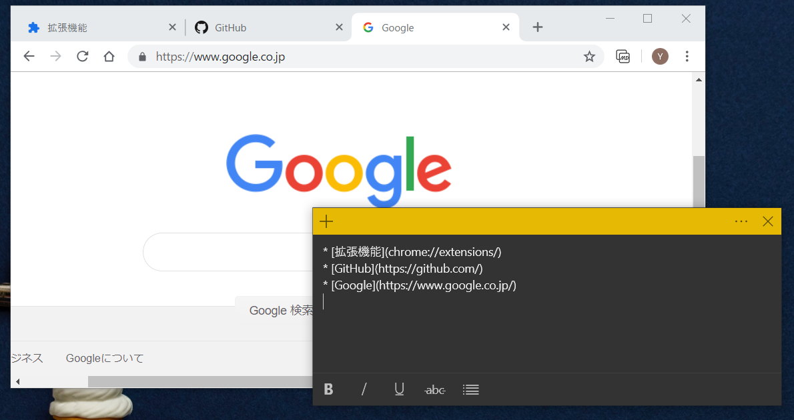
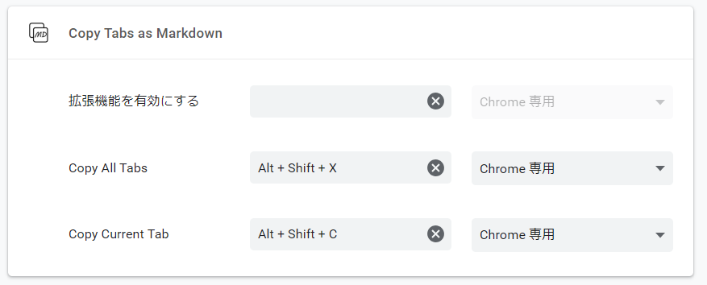

その日見たサイトを記録したいときにURLを一々コピーするのが面倒なので、Markdown形式で簡単にコピーできるChrome拡張を作りました。

[Copy Tabs as Markdown - Chrome ウェブストア](https://chrome.google.com/webstore/detail/copy-tabs-as-Markdown/bijpamokpnoogjbboljnepcbmookobnm)

既にChrome Web Storeに同じようなものがあったんですが、現在のタブと全部のタブをどっちもショートカットキー一発でコピーしたいのと、日本語URLを日本語のままでコピーしたいので自分で作りました。

エンコードされたURLは長くて見辛いのでこっちの方が簡潔で良いです。

ショートカットキー一発で現在のタブまたは全部のタブの、タイトルとURLをMarkdownでクリップボードにコピーできます。

Markdown以外にも好きな形式に変えられます。

